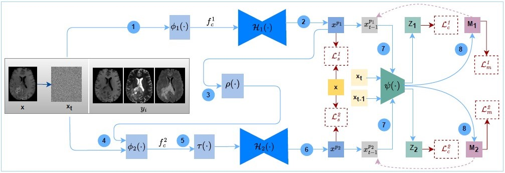

# MU-Diff: A Mutual Learning Diffusion Model for Synthetic MRI with Application for Brain lesions

This repo contains the supported pytorch code and configurations for Mutual Learning Diffusion Model for Synthetic MRI with Application for Brain lesions Article.

**Abstract**  <br />
Synthesizing brain MRI lesions poses significant challenges due to the heterogeneity of lesion characteristics and the complexity of capturing fine-grained pathological information across MRI contrasts. This is particularly challenging when synthesizing contrast-enhanced MRIs, as it requires modelling subtle contrast changes to enhance lesion visibility. Additionally, effectively leveraging of the complementary information across multiple contrasts remains difficult due to their diverse feature representations. To address these challenges, we propose a mutual learning-based framework for brain lesion MRI synthesis using an adversarial diffusion approach. Our framework employs two mutually learned denoising networks with distinct roles: one focuses on capturing contrast-specific features to handle the diverse feature representations across multiple contrasts, while the other emphasizes contrast-aware adaptation to model subtle and fine-grained pathological variations. A shared critic network ensures mutual consistency between the networks, ensuring collaborative learning and efficient information sharing. Furthermore, the critic network facilitates the identification of critical lesion regions through uncertainty estimation, directing more attention to these areas during synthesis. We benchmark our approach against state-of-the-art generative architectures, multi-contrast MRI synthesis methods, and conventional diffusion models on two public lesion datasets. We consider each contrast a missing target in different tasks. Additionally, we validate our method on a similar brain tumour dataset and an in-house healthy dataset. Results show that our method outperforms other baselines, delivering accurate lesion synthesis. To further demonstrate the diagnostic value of our synthetic images, we conducted a downstream segmentation evaluation, which revealed superior performance, particularly in challenging synthesis tasks, indicating the plausibility and accuracy of the proposed lesion MRI synthesis method.

**MU-Diff Architecture**  <br />



**Installation Guide**  <br />
Prepare an environment with python>=3.8 and install dependencies
```
pip install -r requirements.txt
```
**Data Preparation**  <br />
The experiments are conducted on two publicly available datasets,
  * BraTS2019 Dataset : [https://www.med.upenn.edu/cbica/brats2019/data.html](https://www.med.upenn.edu/cbica/brats2019/data.html)
  * ISLES2015 Dataset : [https://www.isles-challenge.org/ISLES2015/](https://www.isles-challenge.org/ISLES2015/)

Pre-process nifti files to normalize data and extract middle axial slices. The data split of each dataset is listed in the [data](data) folder

```
python pre_process.py
```
